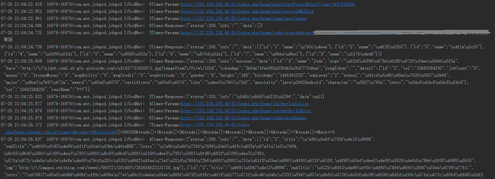

# RequestVolley
基于volley的网络请求库

因为volley用起来比较麻烦。封装一下函数式调用更加方便。是基于某个库(= =,已找不到出处)修改的。  
功能都集中在`RequestManager`里面

##依赖
`compile 'com.jude:requestvolley:1.0.4'`

在APP入口处调用  
`RequestManager.getInstance().init(this);`  
建议这样设置调试模式,所有的网络请求都将排上序号输出。调试模式神好用!!!  
`RequestManager.getInstance().setDebugMode(BuildConfig.DEBUG,"net");`  

调试模式会将所有PostGet请求参数与结果输出出来(Post会转成Get格式)。

##get/post简单调用
`LoadController get(String url, RequestListener requestListener)`  
`LoadController post(final String url, Object data, final RequestListener requestListener)`  
post第二个参数，将调用`data.toString()`来获取post数据。  
提供RequestMap来供添加文本与文件作为表单。  

        RequestMap params = new RequestMap();
        params.put("id","123");
        params.put("id","123");
        params.put("file",new File("xxx"));
        RequestManager.getInstance().post(url,params,callback);
可以重复添加相同key的文本。一次只能上传一个文件。  
可以通过LoadController取消本次请求。

##图片请求
`ImageLoader.ImageContainer img(final String url,final ImageView imageView)`  
`ImageLoader.ImageContainer img(final String url,final ImageView imageView, final int resError)`  
`ImageLoader.ImageContainer img(final String url,final ImageLoader.ImageListener imageListener)`  
很方便的图片请求，10M内存缓存与永久的文件缓存。将自动处理。  
不过，都去用Fresco吧。这个比起来弱爆了。

##全局设置
`void setHeader(HashMap<String,String> header)`  
`void setCacheEnable(boolean isCache)`  
`void setRetryTimes(int times)`  
`void setTimeOut(int time)`  
注意默认是不开启缓存。避免缓存导致调试问题。这些为全局设置。get与post均允许发送特殊请求。  

##缓存机制 
对volley的缓存机制作了些修改，volley源码中这一部分本来也是这个意思，但不知道为什么并没有完成，阉割了？  
根据响应头头的`Cache-Control`字段中。`max-age=`表示有效时间，`soft-age=`表示新鲜时间。  
在新鲜时间之前。只会读取缓存。  
在新鲜时间与有效时间之间。会先读取缓存再网络请求。会返回2次。  
超过有效时间。直接网络请求。  

**另外貌似volley也支持https。也被阉割了。后期再试试完善https部分吧。**

##解析
demo中的DataCallback<T>负责解析。用法很优雅。实现在demo里，本来想放进库里，但与项目耦合太高。网络库也并不负责解析。  

        RequestManager.getInstance().post("https://apiview.com/test/408/RequestVolley/getPerson", null, new DataCallback<Person>() {
                    @Override
                    public void success(String info, Person data) {
                        tvPerson.setText(data.getName()+":"+data.getAge());
                    }
                });

